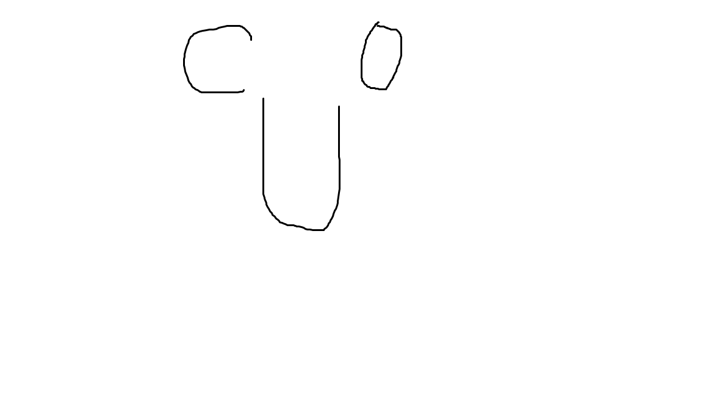

# web1-6

<!DOCTYPE html>
<html lang="ja">
  <head>
    <meta charset="UTF-8">
    <link rel="stylesheet" type="text/css" href="css/default.css">
    <title>あ</title>
  </head>
  <body>
    <article id="main">
      
い

      
      <dl>
        <dt>え：</dt><dd>お</dd>
        <dt>か：</dt><dd>き</dd>
      </dl>
    </article>
  </body>
</html>
